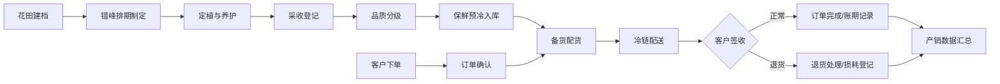

## 1. 产品概述

殡仪鲜花种植供应Web系统，服务于花卉基地从种植到供货的全链路数字化管理。系统覆盖菊花、百合等主供花卉的花田档案管理、错峰种植排期、采后分级保鲜、订单履约配送、客户关系维护及产销数据统计分析，解决传统花卉种植供应链路粗放、错峰生产难、损耗高、账期混乱等痛点。

目标用户为花卉基地管理人员、种植技术员、采收分拣员、订单调度员、物流配送员、财务及销售人员。通过系统化管理，实现清明、冬至等高峰期的稳定供应，降低冷链损耗，提升基地运营效率与客户满意度。

## 2. 核心功能

### 2.1 用户角色

| 角色 | 权限说明 | 核心操作 |
|------|---------|---------|
| 基地管理员 | 全部权限 | 系统配置、数据审核、报表查看、用户管理 |
| 种植技术员 | 花田+排期权限 | 花田档案维护、种植排期编辑、供应预测调整 |
| 采收分拣员 | 采后处理权限 | 采收录入、分级标记、保鲜预冷记录 |
| 订单调度员 | 订单+物流权限 | 订单录入、派单调度、配送跟踪、退货处理 |
| 财务销售 | 客户+统计权限 | 客户档案、账期管理、价格行情、产销报表 |

### 2.2 功能模块

1. **花田台账**：花田档案总览、菊花/百合分区详情、土壤与灌溉信息、种植历史追溯
2. **种植排期**：错峰种植日历、年度排期甘特图、清明冬至供应预测、品种搭配规划
3. **采后处理**：采收登记、品质分级（A/B/C级）、保鲜预冷记录、损耗登记
4. **订单供货**：殡仪馆/花店订单录入、订单状态跟踪、备货配货、发货确认
5. **冷链物流**：配送派单、冷链车辆管理、温湿度监控、在途跟踪、签收确认
6. **客户管理**：殡仪馆/花店客户档案、账期与信用额度、合同管理、退货处理记录
7. **产销统计**：损耗统计看板、价格行情走势、月度/季度产销报表、趋势分析

### 2.3 页面详情

| 页面名称 | 模块名称 | 功能描述 |
|---------|---------|---------|
| 花田台账 | 花田档案卡片 | 展示花田编号、面积、位置、土壤类型、主栽品种、当前状态（空闲/种植中/采收中/休耕） |
| 花田台账 | 菊花百合分区 | 按品种分区展示，包含片区分布热力图、种植批次、定植日期、预计采收期 |
| 花田台账 | 种植历史追溯 | 花田历年种植记录、产量数据、病虫害记录、轮作信息 |
| 种植排期 | 错峰种植日历 | 月/周视图日历，标记定植、养护、采收关键节点，颜色区分品种 |
| 种植排期 | 年度排期甘特 | 年度横向甘特图，展示各批次从定植到采收的时间轴，叠加预测产量曲线 |
| 种植排期 | 清明冬至预测 | 基于历史数据和节日时间，自动推算所需种植面积与定植窗口，给出预警建议 |
| 采后处理 | 采收登记台 | 扫码/手输采收批次、花田来源、采收数量、采收人员、采收时间 |
| 采后处理 | 品质分级 | A/B/C级分级录入，含花径、杆长、开放度、新鲜度指标，分级合格率统计 |
| 采后处理 | 保鲜预冷 | 预冷温度/时长记录、保鲜剂使用、入出库时间、存储库位 |
| 订单供货 | 订单列表看板 | 按待确认/备货中/已发货/已完成/已取消分类展示订单卡片与状态流转 |
| 订单供货 | 订单录入 | 客户选择、品种/数量/规格、配送地址/时间、价格、备注信息录入 |
| 订单供货 | 备货配货 | 订单与冷库库存匹配、拣货清单生成、配货复核确认 |
| 冷链物流 | 配送调度 | 订单指派车辆/司机、路线规划、发车时间、预计到达时间 |
| 冷链物流 | 温湿度监控 | 冷链箱/车辆实时温湿度曲线、超阈值告警、历史数据回溯 |
| 冷链物流 | 在途跟踪 | 配送节点更新、签收照片上传、异常登记 |
| 客户管理 | 客户档案列表 | 殡仪馆/花店基本信息、合作等级、历史采购量、联系人信息、标签分类 |
| 客户管理 | 账期与信用 | 账期设置、信用额度、应收明细、逾期告警、回款记录 |
| 客户管理 | 退货处理 | 退货申请登记、原因分类、数量确认、退款/补货处理、损耗计入 |
| 产销统计 | 损耗统计看板 | 按环节（种植/采收/分级/冷链/退货）展示损耗率与数量，支持多维筛选 |
| 产销统计 | 价格行情 | 菊花/百合各等级历史价格走势线、同期对比、市场均价参考 |
| 产销统计 | 产销报表 | 月度/季度/年度产销汇总表、产量-销量-库存对比、客户维度销售排名 |

## 3. 核心流程

主业务流程：从花田建档开始，依据节日预测制定错峰排期→定植后日常养护记录→到采收期进行采收登记→品质分级与保鲜预冷入库→接收客户订单→备货配货→冷链配送→客户签收/退货→数据汇总至产销统计与账期管理。

## 4. 用户界面设计

### 4.1 设计风格
- **主色调**：深墨绿 `#1f4d3a`（代表花卉生长、自然沉稳）+ 米白 `#f7f4ed`（干净、庄重、素雅）
- **辅助色**：菊花黄 `#e8b923`（点缀强调）、百合白 `#f0ebe0`（背景层级）、警示红 `#c0392b`（损耗/告警）
- **按钮风格**：圆角矩形（6px），实心深墨绿主按钮配悬停微变亮；次要按钮描边填充
- **字体**：标题使用「思源宋体」凸显庄重典雅；正文使用「思源黑体」保证易读性
- **布局风格**：左侧固定导航栏 + 顶部信息栏 + 主体卡片式布局，卡片带柔和阴影与描边
- **图标风格**：线性简约图标，配色与主题统一，辅以菊花/百合装饰元素

### 4.2 页面设计概览

| 页面名称 | 模块名称 | UI元素与风格 |
|---------|---------|-------------|
| 花田台账 | 档案卡片 | 卡片网格布局，顶部搜索筛选栏；卡片内含状态徽章、迷你长势趋势图、渐变进度条 |
| 种植排期 | 日历/甘特 | 左筛选右主体双栏；甘特图采用渐变色块，悬停显示详情；预测模块使用预警色卡片 |
| 采后处理 | 登记/分级 | 步骤条引导流程；分级模块使用彩色标签区分A/B/C级；表格带斑马纹与汇总行 |
| 订单供货 | 订单看板 | 横向流水式状态列，订单卡片可拖拽流转；顶部进度数字计数器带动效 |
| 冷链物流 | 监控/跟踪 | 左侧车辆列表，右侧地图式路线+温湿度曲线图；告警条悬浮顶部 |
| 客户管理 | 档案/账期 | 表格+详情抽屉布局；账期用进度条展示已用/剩余额度；退货用标签色标记原因 |
| 产销统计 | 看板/报表 | 数字大屏风格顶部指标卡（渐变背景）、双Y轴折线图、堆叠柱状图、环形图 |

### 4.3 响应式
- 桌面端优先，主体宽度1440px自适应
- 平板端：左侧导航折叠为图标列，卡片列数自适应
- 移动端：导航切换为底部Tab，卡片单列，表格改为卡片列表
- 所有数据图表支持触控缩放与滑动查看

### 4.4 动效与细节
- 页面加载：顶部进度条+卡片淡入交错出现
- 数据更新：数字滚动动效、图表曲线绘制动画
- 状态流转：颜色渐变动效、微弹跳反馈
- 悬停交互：卡片轻微上浮+阴影加深、按钮背景过渡
