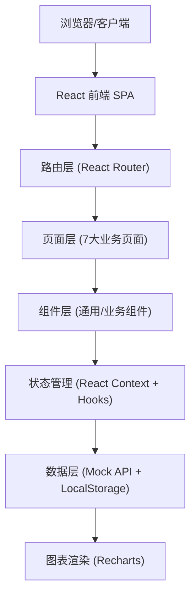
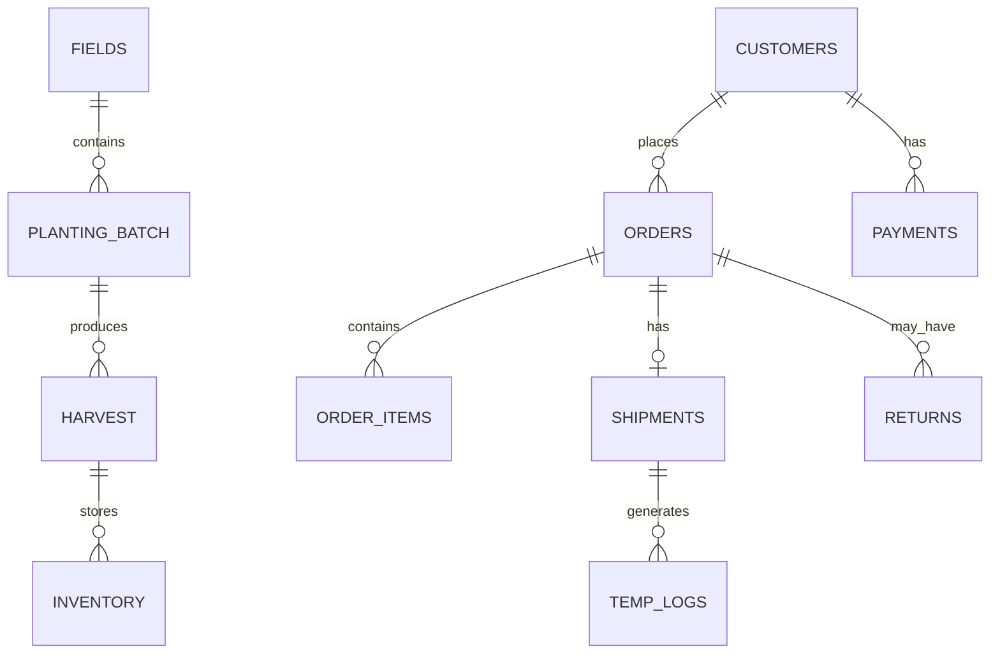

## 1. 架构设计



## 2. 技术说明

- **前端框架**：React 18 + TypeScript，使用函数组件 + Hooks
- **构建工具**：Vite 5，支持快速热更新与生产构建
- **样式方案**：Tailwind CSS 3，CSS变量主题切换
- **路由**：React Router v6，Hash路由模式
- **状态管理**：React Context 分模块管理（种植/订单/物流/客户/统计）
- **图表库**：Recharts（甘特图、折线图、柱状图、饼图）
- **图标**：Lucide React（线性图标库）
- **UI组件基础**：自研轻量组件（表格、卡片、徽章、进度条、步骤条）
- **数据层**：Mock数据 + LocalStorage持久化，模块内封装DataService

## 3. 路由定义

| 路由路径 | 页面名称 | 说明 |
|---------|---------|------|
| `/` | 花田台账 | 默认首页，展示花田档案概览与分区详情 |
| `/planting-schedule` | 种植排期 | 错峰种植日历、甘特排期、节日预测 |
| `/post-harvest` | 采后处理 | 采收登记、分级、保鲜预冷 |
| `/orders` | 订单供货 | 订单看板、录入、备货配货 |
| `/logistics` | 冷链物流 | 配送调度、温湿度监控、在途跟踪 |
| `/customers` | 客户管理 | 客户档案、账期信用、退货处理 |
| `/statistics` | 产销统计 | 损耗、价格行情、产销报表 |

## 4. 数据模型

### 4.1 实体关系



### 4.2 核心数据结构

```typescript
// 花田档案
interface Field {
  id: string;
  code: string;          // 花田编号
  name: string;
  area: number;          // 亩数
  location: string;
  soilType: string;      // 土壤类型
  irrigation: string;    // 灌溉方式
  mainVariety: string;   // 主栽品种
  status: 'idle' | 'growing' | 'harvesting' | 'fallow';
  plantedAt?: string;
  harvestAt?: string;
}

// 种植批次
interface PlantingBatch {
  id: string;
  fieldId: string;
  variety: 'chrysanthemum' | 'lily';
  breed: string;         // 具体品种
  area: number;
  plantedAt: string;
  expectedHarvestAt: string;
  forecastYield: number; // 预估产量 枝
  season: string;
}

// 采收记录
interface Harvest {
  id: string;
  batchId: string;
  fieldId: string;
  harvestedAt: string;
  quantity: number;
  staff: string;
  gradeAQty: number;
  gradeBQty: number;
  gradeCQty: number;
  defectiveQty: number;
}

// 库存/预冷
interface Inventory {
  id: string;
  harvestId: string;
  variety: string;
  grade: 'A' | 'B' | 'C';
  quantity: number;
  preCooledAt: string;
  preCoolTemp: number;
  preCoolDuration: number; // 小时
  preservative: string;
  location: string;        // 库位
  status: 'stored' | 'allocated' | 'shipped';
}

// 客户
interface Customer {
  id: string;
  name: string;
  type: 'funeral_home' | 'flower_shop' | 'distributor';
  contact: string;
  phone: string;
  address: string;
  level: 'A' | 'B' | 'C';
  creditLimit: number;
  paymentTerms: number;    // 账期天数
  usedCredit: number;
  status: 'active' | 'inactive';
}

// 订单
interface Order {
  id: string;
  orderNo: string;
  customerId: string;
  createdAt: string;
  deliveryDate: string;
  deliveryAddress: string;
  totalAmount: number;
  status: 'pending' | 'confirmed' | 'picking' | 'shipped' | 'completed' | 'cancelled' | 'returned';
  items: OrderItem[];
  remarks?: string;
}

interface OrderItem {
  id: string;
  variety: string;
  grade: 'A' | 'B' | 'C';
  quantity: number;
  unitPrice: number;
}

// 冷链配送
interface Shipment {
  id: string;
  orderId: string;
  vehicleNo: string;
  driver: string;
  departedAt?: string;
  estimatedArrival?: string;
  arrivedAt?: string;
  status: 'pending' | 'in_transit' | 'arrived' | 'completed';
  tempLogs: TempLog[];
  route?: string;
}

interface TempLog {
  time: string;
  temperature: number;
  humidity: number;
}

// 退货
interface Return {
  id: string;
  orderId: string;
  customerId: string;
  reason: string;
  quantity: number;
  amount: number;
  processedAt: string;
  disposal: 'refund' | 'replace' | 'writeoff';
}
```

## 5. 模块划分

```
src/
├── assets/            静态资源（样式入口、图片占位）
├── components/        通用组件
│   ├── Layout/        布局（Sidebar + Header + Content）
│   ├── ui/            基础UI（Card, Badge, Button, Table, Progress, Steps）
│   └── charts/        图表包装组件
├── pages/             7大业务页面
│   ├── FieldLedger/
│   ├── PlantingSchedule/
│   ├── PostHarvest/
│   ├── Orders/
│   ├── Logistics/
│   ├── Customers/
│   └── Statistics/
├── data/              Mock数据 + 数据服务层
├── context/           全局状态Context
├── types/             TypeScript类型定义
├── utils/             工具函数（日期、金额、格式化）
├── App.tsx
└── main.tsx
```

## 6. 性能与体验

- 路由懒加载，减少首屏体积
- 图表数据按需计算，避免重复渲染
- 表格使用虚拟滚动（数据量>100时）
- LocalStorage缓存统计结果，页面刷新保留状态
- 表单验证实时反馈，操作前二次确认
